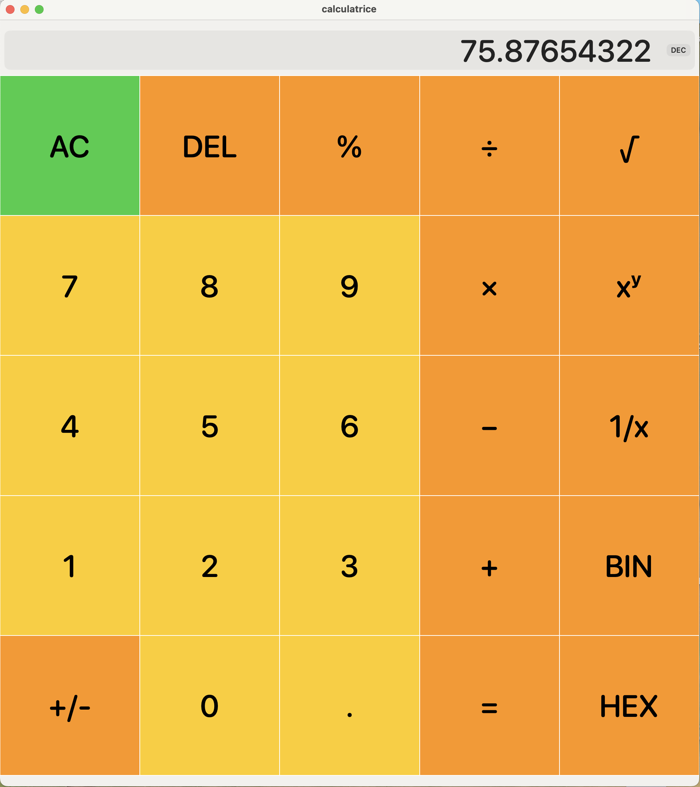
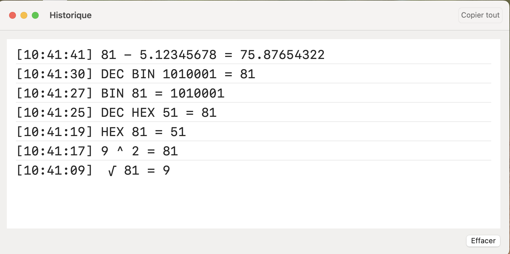

# SwiftUI-Calculatrice
Calculatrice simple en SwiftUI, avec historique horodaté et conversion binaire/hexadécimale. Projet personnel de référence pour l’apprentissage de Swift.

# 🧮 Calculatrice SwiftUI

Petite calculatrice écrite en **SwiftUI**, conçue dans un but pédagogique pour l’apprentissage du langage **Swift**.  
Elle intègre les opérations de base, les pourcentages, plusieurs opérations unaires, ainsi que la conversion en bases **binaire (BIN)** et **hexadécimale (HEX)**.

## ✨ Fonctionnalités

- ➕➖✖️➗ Opérations arithmétiques de base  
- √, 1/x, +/−, % — opérations unaires  
- Conversion DEC → BIN → HEX et inverse  
- Historique horodaté des opérations  
- Raccourcis clavier pour une utilisation fluide sur Mac  
- Interface simple et responsive (SwiftUI, LazyVGrid)

---

## 📸 Aperçu

### vue de la Calculatrice :

### vue de la fenêtre de l'historique : 

---

## 🧰 Prérequis

- macOS 15.5+  
- Xcode 16.3+

---

## Crédits et contexte

Ce projet a été réalisé dans un but **strictement pédagogique**, dans le cadre de mon apprentissage du langage Swift.  
Le code et la structure de cette calculatrice ont été développés avec l’assistance de ChatGPT (OpenAI), en suivant un travail itératif de compréhension, d’explications et d’ajustements personnels.

Je ne revendique pas la paternité exclusive du code : mon objectif est d'en comprendre le fonctionnement et de le partager comme **référence d'apprentissage** pour d'autres débutants.

---

📚 Documentation complémentaire :
- [Optionnels en Swift](./docs/Optionnels.md)

